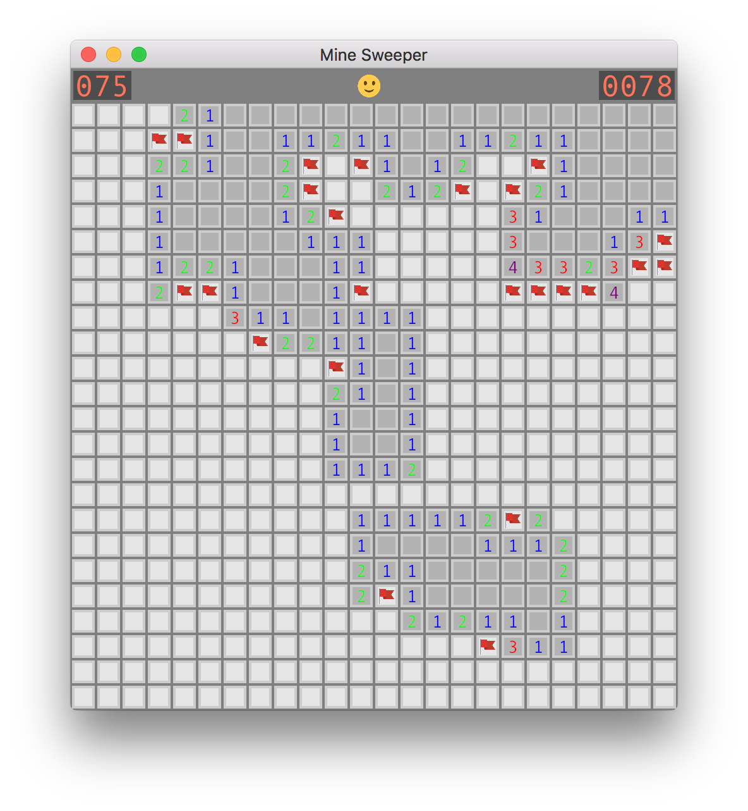
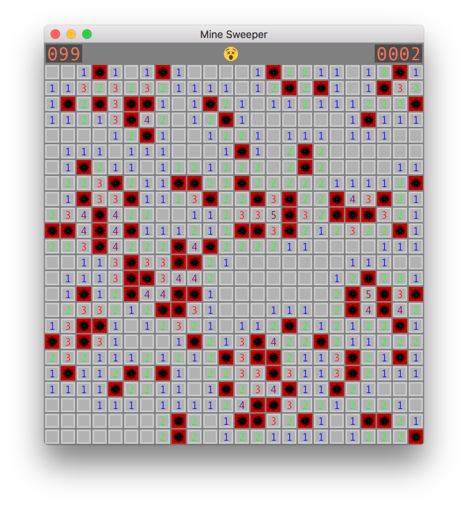

# minesweep-rs
Windows Minesweeper clone in Rust

## How to Play

Identical to Windows Minesweeper, flag all mines.

Controls:

* `R` - restart game
* `Left click` - reveal cell
* `Right click` - toggle flag cell
* `Esc` - exit game
* `Up/Down arrow` - cycle difficulty (Beginner <-> Intermediate <-> Expert <-> Custom)

## Examples
Number of flags left displayed on left, time elapsed on right.


Game board revealed once the game is lost.


Success! (On beginner because I'm a scrub :P)


## How to Build

```bash
git clone https://github.com/eric1221bday/minesweep-rs.git
cd minesweep-rs
cargo build --release
./target/release/minesweep-rs
```

## How to Run
To display help run `minesweep-rs -h`
```
minesweep-rs 0.1.0
Eric Fang
Clone of Windows Minesweeper written in Rust

USAGE:
    minesweep-rs [OPTIONS]

FLAGS:
    -h, --help       Prints help information
    -V, --version    Prints version information

OPTIONS:
    -c, --cols <COLS>           Sets number of columns (Custom level only)
    -d, --difficulty <LEVEL>    Preset Difficulty Level, 1=Beginner 2=Intermediate 3=Expert 4=Custom
    -m, --mines <MINES>         Sets max number of mines (Custom level only)
    -r, --rows <ROWS>           Sets number of rows (Custom level only)
```
* Beginner: 8x8 grid, 10 mines
* Intermediate: 16x16 grid, 40 mines
* Expert: 24x24 grid, 99 mines